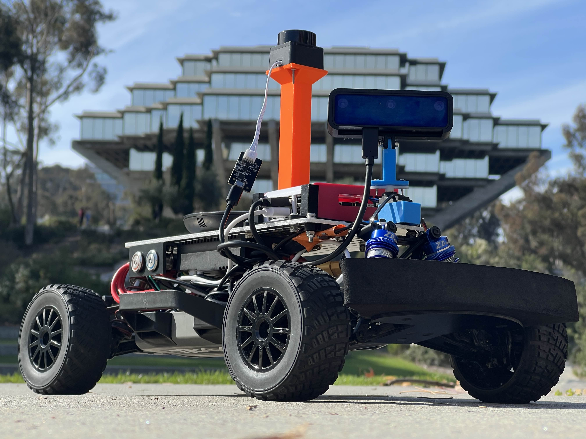
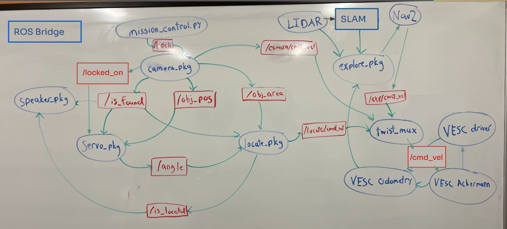

<div id="top"></div>

<h1 align="center">Lost and Found Bot</h1>

<br />
<div align="center">
  <a href="https://jacobsschool.ucsd.edu/">
    
  </a>
<h3>ECE/MAE 148 Final Project</h3>
<p>
Team 10 Fall 2025
</p>


</div>

## Team Members

<ul>
  <li>Jose Chan - CSE & MATH</li>
  <li>Kaz Veitas - MAE</li>
  <li>Mat Hsu - MAE</li>
  <li>Adriel Landeos - ECE </li>
</ul>

## Overview
The **Lost and Found Bot** is an autonomous mobile robot designed to search an unknown environment, locate a specific target object, and navigate to it. The system mimics a real-world search-and-rescue or retrieval scenario.

The robot begins **Identify Mode**, in which you present an item to the camera that the bot will look for. Once you lock the robot onto a specific item, the robot enters **Exploration Mode**, using SLAM and Frontier Exploration to map and explore the room autonomously. Once the onboard computer vision system detects the target object (the "Lost" item), the robot switches to **Retrieval Mode**. It cancels the exploration, locks onto the target using visual servoing, and drives to the object's location to "Find" it, announcing arrival via audio feedback.

### Key Features
* **Autonomous Mapping:** Uses `slam_toolbox` and `explore_lite` to map unknown environments without human intervention.
* **Navigation Stack:** Utilizes **Nav2** for path planning and obstacle avoidance during the search phase.
* **Object Detection:** Real-time YOLO-based detection to identify target objects from the OAK-D camera feed, and Mobile-net V2 to embed and compare objects.
* **Visual Servoing:** Custom control loop to center the robot on the target and approach it once detected.
* **Twist Mux Control:** Seamless switching between Navigation control (exploring), Visual Servoing control (approaching). Prioritizes camera feed to lock the robot in place during object identification and retrieval.
* **Audio Feedback:** Plays sound cues upon locating the object.

## System Architecture
<div align="center">
  
  <br>
  <em>*Disclaimer: This graph is a simplified overview and does not represent the full list of nodes and topics.</em>
</div>

### Node Descriptions
* **`Lidar`**: Scans the surrounding environment and sends point cloud data to SLAM.
* **`SLAM`**: Receives Lidar scans and odometry data to build a map and estimate the robot's current pose.
* **`explore.pkg`**: Analyzes the SLAM map to find "frontiers" (unknown areas) and sends goals to Nav2.
* **`nav2`**: Calculates the path to the frontier and outputs velocity commands (`/nav/cmd_vel`) to avoid obstacles.
* **`camera.pkg`**: Runs the object detection model. Publishes the object's position (`/obj_pos`), size (`/obj_area`), and a boolean flag (`/is_found`).
* **`servo.pkg`**: Sweeps the camera to scan the room. Upon detection, it halts and publishes the current camera angle to the location package.
* **`locate.pkg`**: A proportional controller that calculates the velocity needed to center the robot on the detected object (`/locate/cmd_vel`).
* **`mission_control.py`**: The brain. It monitors `/is_found`. If false, it allows Exploration. If true, it locks the `twist_mux` to the Camera controller and triggers the speaker.
* **`twist_mux`**: A priority multiplexer that routes either the Navigation velocity OR the Visual Servoing velocity to the wheels (`/cmd_vel`).
* **`Vesc Ackermann`**: Receives `/cmd_vel` from the Mux, converts Twist (angular velocity) to Ackermann (steering angle), and publishes to the VESC.
* **`Vesc Driver`**: Interfaces with the hardware. Executes motor commands and publishes real-time sensor feedback (RPM, ticks) for odometry.
* **`Vesc Odometry`**: Combines steering angle commands and wheel encoder feedback to calculate the robot's position change (/odom).
* **`speaker.pkg`**: Receives state updates to trigger audio announcements (e.g., "Target Found", "Arrived").
* **`Rosbridge`**: Opens a WebSocket connection to allow live visualization of camera, Lidar, and map feeds on Foxglove Studio. 

### Data Flow
1.  **LIDAR** & **Encoders** $\rightarrow$ **SLAM** $\rightarrow$ **Map**.
2.  **Explore Node** reads Map $\rightarrow$ sends Goal to **Nav2**.
3.  **Nav2** drives robot to explore.
4.  **Camera** detects Object $\rightarrow$ sends signal to **Mission Control**.
5.  **Mission Control** disables Nav2 $\rightarrow$ enables **Locate Pkg**.
6.  **Locate Pkg** drives robot to target $\rightarrow$ **Speaker** plays sound.

## Demonstration

Below is a demonstration of the robot autonomously mapping a room until it spots the target box, at which point it interrupts the search to approach the target.

<div align="center">
  
  
  
  
  

</div>

### Hardware
* **Chassis:** Traxxas Slash (modified for autonomous control).
* **Compute:** Raspberry Pi 5.
* **Sensors:**
    * LIDAR (LD06) for SLAM and Obstacle Avoidance.
    * OAK-D Lite / RealSense for Object Detection.
    * VESC (Vedder Electronic Speed Controller) for motor control and odometry.
* **Actuators:** Standard Steering Servo, Brushless DC Motor.

### Software Libraries
* **ROS 2 Foxy** (running via Docker)
* **Nav2** (Navigation Stack)
* **SLAM Toolbox** (Mapping)
* **m-explore-ros2** (Explore Lite)
* **DepthAI / OpenCV** (Vision)

## How to Run

1.  **Build and Source packages:**
    ```bash
    source /opt/ros/foxy/setup.bash
    build colcon
    source install/setup.bash
    ```
2.  **Start the Navigation & SLAM Stack:**
    ```bash
    ros2 launch master7.launch.py
    ```
3.  **Run Mission Control:**
    ```bash
    python3 mission_control.py
    ```

    Make sure to lock onto an item before moving on
4.  **Run Exploration:**
    ```bash
    ros2 run explore_lite explore --ros-args --params-file /home/projects/ros2_ws/src/explore.yaml
    ```

## Acknowledgments
* **Professor Jack Silberman** for the course guidance.
* **TA Team (Winston, Aryan)** for the technical support.
* Inspiration from Teams 4 and 7 Fall 2024 for github readme.
